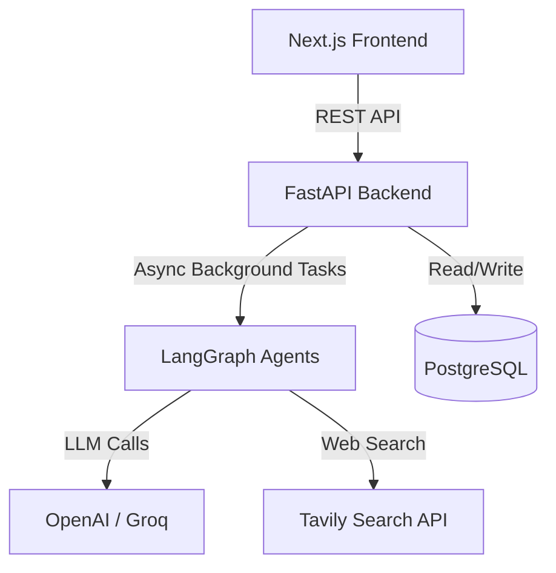

<div align="center">
  
  
  # MarketMind

  **Validate. Analyze. Launch.**

  [🚀 Live Demo](https://market-mind-taupe.vercel.app)

  *An AI-powered SaaS that takes a one-sentence startup idea and produces a comprehensive, data-driven validation report in minutes.*

  [](https://nextjs.org/)
  [](https://fastapi.tiangolo.com/)
  [](https://python.langchain.com/)
  [](https://www.postgresql.org/)
  [](https://stripe.com/)
  [](https://clerk.com/)
</div>

<br />

> **Stop guessing if your idea will work. Know it.** 
> MarketMind automatically researches competitors, sizes the market, estimates investment, and scores your odds of success using an advanced multi-agent AI pipeline.

## 🚀 Key Features

- **🧠 Multi-Agent AI Pipeline (LangGraph)**: 9 specialized AI agents work in parallel to analyze your idea from every angle.
- **📊 Comprehensive Data & Analytics**: Get a SWOT analysis, Lean Canvas, Business Model Canvas, and market size estimates.
- **💬 Interactive AI Advisor**: Chat directly with an AI trained specifically on your generated validation report.
- **📄 Export Ready**: Download your complete business plan as a polished PDF or DOCX file.
- **💳 Production-Ready SaaS**: Fully integrated with Stripe for subscriptions, Clerk for secure auth, and Neon Postgres for scalable storage.

## 🏗️ Architecture

MarketMind is built on a modern, highly scalable full-stack architecture:

- **Frontend**: Next.js 15 (App Router), React, Tailwind CSS, shadcn/ui.
- **Backend**: Python, FastAPI, SQLAlchemy, BackgroundTasks (for asynchronous AI pipelines).
- **AI Infrastructure**: LangGraph, OpenAI SDK, Tavily Web Search.
- **Infrastructure**: Docker, PostgreSQL.



## 🛠️ The Validation Pipeline

Our custom LangGraph pipeline ensures deterministic, structured JSON output at every stage:

1. `understand_idea` → 2. `web_search` → 3. `competitor_analysis` → 4. `market_research` → 5. `investment_estimate` → 6. `location_recommendation` → 7. `swot_and_canvases` → 8. `business_strategy` → 9. `success_score`

## 💻 Getting Started (Local Development)

### The Fastest Path: Docker

```bash
# 1. Clone the repository
git clone https://github.com/your-username/MarketMind.git
cd MarketMind

# 2. Setup environment variables
cp backend/.env.example backend/.env
cp frontend/.env.example frontend/.env.local

# 3. Add your API keys to the .env files (OPENAI_API_KEY at minimum)

# 4. Boot the entire stack
docker compose up --build -d
```

- **Frontend Application**: `http://localhost:3000`
- **Backend Swagger Docs**: `http://localhost:8000/docs`

## 🌍 Deployment

MarketMind is designed to be effortlessly deployed to modern cloud platforms:

- **Frontend** → Vercel (zero-config Next.js deployment).
- **Backend** → Render, Railway, or Hugging Face Spaces via `Dockerfile` and `render.yaml`.
- **Database** → Neon (Serverless Postgres) or Supabase.

## 🤝 Contributing

We welcome contributions! Please see our [CONTRIBUTING.md](CONTRIBUTING.md) for details on our code of conduct and the process for submitting pull requests.

## 📄 License

This project is licensed under the MIT License - see the [LICENSE](LICENSE) file for details.
